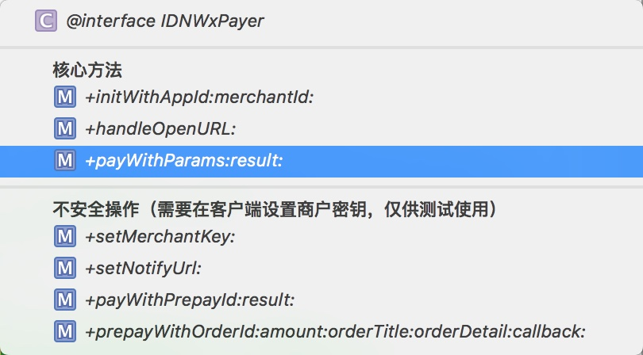
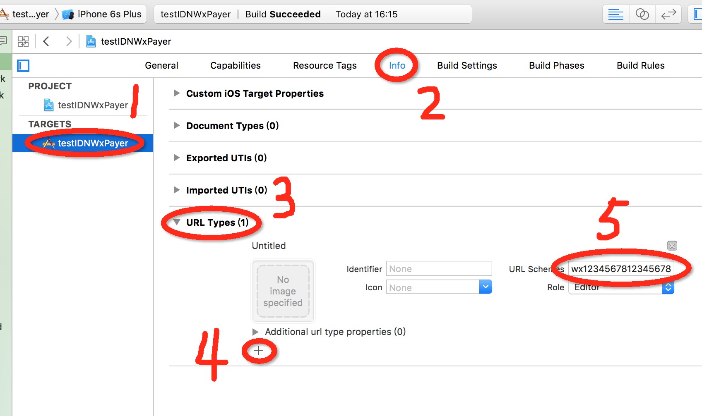
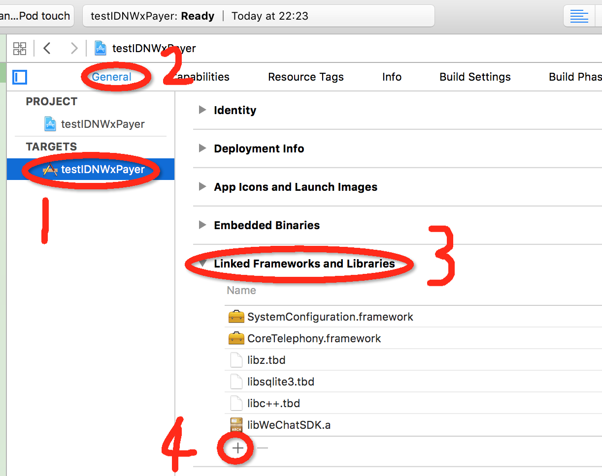

<!-- START doctoc generated TOC please keep comment here to allow auto update -->
<!-- DON'T EDIT THIS SECTION, INSTEAD RE-RUN doctoc TO UPDATE -->
- [iOS 微信支付助手 IDNWxPayer](#ios-%E5%BE%AE%E4%BF%A1%E6%94%AF%E4%BB%98%E5%8A%A9%E6%89%8B-idnwxpayer)
  - [使用方法](#%E4%BD%BF%E7%94%A8%E6%96%B9%E6%B3%95)
    - [项目准备](#%E9%A1%B9%E7%9B%AE%E5%87%86%E5%A4%87)
    - [微信支付流程](#%E5%BE%AE%E4%BF%A1%E6%94%AF%E4%BB%98%E6%B5%81%E7%A8%8B)
    - [编写支付代码](#%E7%BC%96%E5%86%99%E6%94%AF%E4%BB%98%E4%BB%A3%E7%A0%81)
      - [正常情况😄](#%E6%AD%A3%E5%B8%B8%E6%83%85%E5%86%B5%F0%9F%98%84)
      - [情况2🙁](#%E6%83%85%E5%86%B52%F0%9F%99%81)
      - [情况3😠](#%E6%83%85%E5%86%B53%F0%9F%98%A0)
  - [参考](#%E5%8F%82%E8%80%83)

<!-- END doctoc generated TOC please keep comment here to allow auto update -->

# iOS 微信支付助手 IDNWxPayer

demo示例程序 <https://github.com/photondragon/IDNWxPaySample>  
示例程序要想正常运行，需要修改项目的 URL Schemes 和application:didFinishLaunchingWithOptions: 中的微信支付的初始化参数（参考后面的“项目准备”一节）

IDNWxPayer 对微信支付ios端的整个支付流程进行了封装，把复杂的细节都屏蔽掉了，对外提供了简单易用的接口（全部都是+方法），下图列出了提供的接口方法：  
  
必定要调用的“核心方法”有三个，实际发起支付的方法就一个，其它的所谓“不安全操作”的方法只有在服务端开发没有完成的情况下才有必要使用。  
全部的代码都封装在两个源文件中，IDNWxPayer.h 和 IDNWxPayer.m ，除了微信官方提供的SDK库以外，不依赖任何第三方库。

<!--more-->

如果你发现了任何bug，欢迎[提交Issues](https://github.com/photondragon/IDNWxPaySample/issues "提交Issues")

## 使用方法

开发环境：xcode 7.3 + OS X EI Capitan 10.11.3

### 项目准备

1. 创建一个全新的xcode项目，加入源文件 IDNWxPayer.h 和 IDNWxPayer.m
2. 下载 [微信支付官方SDK](https://res.wx.qq.com/open/zh_CN/htmledition/res/dev/download/sdk/WeChatSDK1.7.1.zip "微信支付官方SDK") ，把解压出来的文件夹 OpenSDK1.7.1 整个加入项目中
3. 为项目添加 URL Schemes = <你的微信支付的appId>  
	
4. 链接这几个库: libc++.tdb, libsqlite3.tbd, libz.tbd, CoreTelephony.framework, SystemConfiguration.framework  
	
5. 在 AppDelegate.m 中加入初始化代码，**注意要把初始化参数换成你自己的**

    ``` objective-c
    #import "IDNWxPayer.h"

    // 。。。其它代码。。。

	- (BOOL)application:(UIApplication *)application didFinishLaunchingWithOptions:(NSDictionary *)launchOptions {
	
		[IDNWxPayer initWithAppId:@"wx1234567812345678" merchantId:@"1234567890"]; //
		[IDNWxPayer setMerchantKey:@"12345678901234567890123456789012"]; //设置商户密钥，仅供测试使用
		[IDNWxPayer setNotifyUrl:@"http://www.example.com/wxnotify.php"]; //仅供测试使用
	
		return YES;
	}

	// ios < 9.0
	- (BOOL)application:(UIApplication *)application openURL:(NSURL *)url sourceApplication:(NSString *)sourceApplication annotation:(id)annotation
	{
		if([IDNWxPayer handleOpenURL:url]) //处理从微信客户端跳转回来的url。返回 TRUE 表示成功处理了
			return YES;
		return NO;
	}
	
	// ios >= 9.0
	- (BOOL)application:(UIApplication *)application openURL:(NSURL *)url options:(NSDictionary<NSString *,id> *)options
	{
		if([IDNWxPayer handleOpenURL:url]) //处理从微信客户端跳转回来的url。返回 TRUE 表示成功处理了
			return YES;
		return NO;
	}

	```

现在你可以开始编写支付代码了，不过在这之前，最好先了解一下微信支付流程

### 微信支付流程
1. 向微信下单，得到prepayId（建议在服务端实现）
2. 根据prepayId生成**包含签名**的“支付请求参数”（建议在服务端实现）
3. 你的客户端发起支付（需要第2步生成的支付请求参数）
4. 自动跳转到微信客户端，用户付款，成功或取消后会自动跳转回你的客户端（如果付款成功，微信服务器会通知你的服务器）
5. 你的客户端（向你的服务器）验证支付结果

### 编写支付代码

#### 正常情况😄

如果你们的服务端小伙伴把微信支付流程的第1，2步都搞定了，把支付请求参数传给了客户端😄，那么你只需要调用 +payWithParams:result: 方法就可以发起微信支付了，示例代码如下：

``` objective-c
[IDNWxPayer payWithParams:payParams result:^(NSError *error) {
	if(error){
		NSLog(@"支付失败：%@", error.localizedDescription);
	}
	else{
		NSLog(@"支付成功（只是“支付”成功）");
		// todo 这里还要向你的服务器验证支付结果（检测订单是否完成）
	}
}];

```
**注意**：result这个block是用来接收支付结果的，error==nil表示支付成功，否则表示支付失败。但是result这个block**不一定会被调用**，因为你可以在跳转到微信客户端后直接关闭微信，然后手动点开自己的应用，而不是让微信自动跳回。这种情况怎么处理可以到 IDNWxPayer.h 里去看函数文档。

#### 情况2🙁

如果你们的服务端小伙伴搞定了微信支付流程的第1步，然后给了你一个prepayid🙁，那么你可以调用 +payWithPrepayId:result: 方法发起微信支付，但必须在初始化的时候调用 +setMerchantKey: 设置商户密钥（用于签名），示例代码如下：

``` objective-c
[IDNWxPayer payWithPrepayId:prepayId result:^(NSError *error) {
	if(error){
		NSLog(@"支付失败：%@", error.localizedDescription);
	}
	else{
		NSLog(@"支付成功（只是“支付”成功）");
		// todo 这里还要向你的服务器验证支付结果（检测订单是否完成）
	}
}];

```

#### 情况3😠

如果你们的服务端小伙伴连微信支付流程的第1步都还没搞定😠，怎么办呢？当然有办法，我们可以自己向微信服务器下单（前提是在初始化的时候设置了merchantKey和notifyUrl）。  
先调用 +prepayWithOrderId:amount:orderTitle:orderDetail:callback: 方法下单（参数你就随便填吧，反正只是测试），下单成功后通过 callback 得到支付请求参数，再调用 +payWithParams:result: 发起支付，示例代码如下：

``` objective-c
[IDNWxPayer prepayWithOrderId:orderId amount:amount orderTitle:orderTitle orderDetail:nil callback:^(NSDictionary *payParams, NSError *error) {
	if(error){
		NSLog(@"下单失败：%@", error.localizedDescription);
	}
	else{
		NSLog(@"下单成功：%@", payParams);
		// 发起微信支付
		[IDNWxPayer payWithParams:payParams result:^(NSError *error) {
			// ...此处省略处理支付结果的代码...
		}];
	}
}];
```

## 参考
1. [微信支付官方IOS文档](https://pay.weixin.qq.com/wiki/doc/api/app/app.php?chapter=8_5 "微信支付官方IOS文档") 
2. [微信支付全部 SDK 下载页面](https://pay.weixin.qq.com/wiki/doc/api/app/app.php?chapter=11_1 "微信支付全部 SDK 下载页面")
